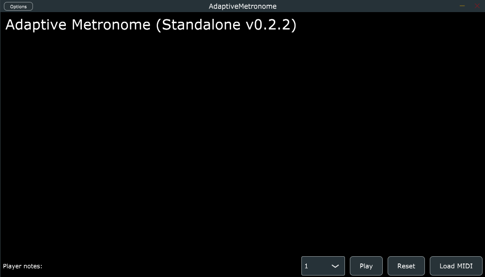

The demonstration for using the **Adaptive Metronome** is simple and straightforward. You will only need to run one file within the cloned/downloaded **[repository](https://github.com/arme-project/AdaptiveMetronome/tree/windows-standalone)**.

If you are not familar with using GIT then do not worry, you can follow the instructions below on how to install the setup and run it:

## 1. Clone the repository
Use the following GIT Command if installed:
```
git clone git@github.com:arme-project/AdaptiveMetronome.git
```

If you do not have GIT Install then you can download the repository as a ZIP file:


## 2. Running the Executable
Within the file, you may run the `AdaptiveMetronome.exe`. However, if that does not work then you will need to navigate into the original executable file: 

```
Builds > VisualStudio2022 > x64 > Debug > Standalone Plugin  > AdaptiveMetronome
```

This should open the GUI:



## 3. Loading MIDI
In the GUI, press `Load MIDI` and navigate where you have cloned (or extracted if you downloaded the ZIP) the repository. Inside, you will find a directory called `Audio` containing MIDI Files. For the purpose of the demonstration, you will only need to use `haydn2` for the Adaptive Metronome. Press on the MIDI file and the GUI should change:


## 4. Press Play
At this point, you can experiment with the different parameters that you can see. In the GUI, press `Play` to start the Ensemble on the loaded MIDI file. If you want to play from the beginning, press `Reset` and this should reset the Ensemble.

You will need to have the [score-follower in MAX/MSP](/am-system-docs/max-msp-patch/about/) to be able to introduce inputs into the metronome but you should be able to hear the ensemble playing.

