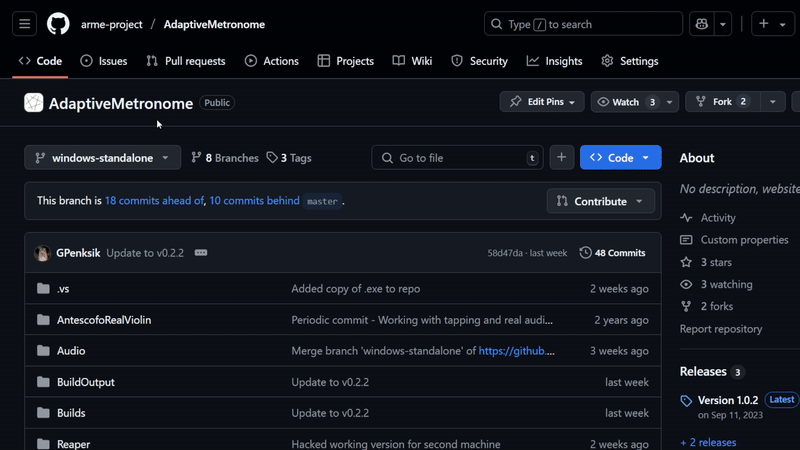
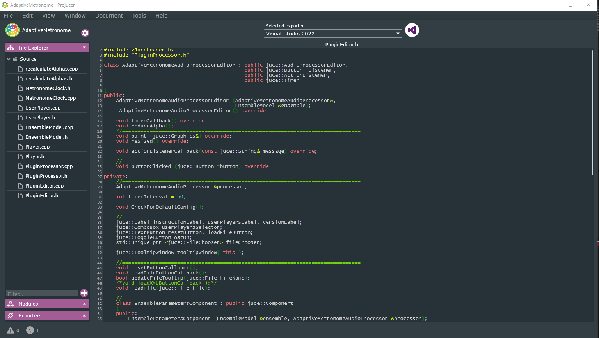

Developing on the Adaptive Metronome requires understanding on how C++ works. If you are new to this then I suggest taking a look at [this site for some guidance](https://www.w3schools.com/cpp/) on the programming language. 

In addition, JUCE provides a [documentation](https://docs.juce.com/master/index.html) on how you can start developing plugins such as the Adaptive Metronome. This is incredibly useful as some parts of C++ may have an equivlant used in JUCE (such as std::string and juce::String)

## 1. Clone the repository
Similarily in setting up the demonstartion, use the following GIT Command if installed:

```
git clone git@github.com:arme-project/AdaptiveMetronome.git
```

If you do not have GIT Install then you can download the repository as a ZIP file:



## 2. Open Projucer and load the JUCE File
When you download and extract [JUCE 7.0.9](https://github.com/juce-framework/JUCE/releases/tag/7.0.9) (for the correct Operating System), you will find an Application called `Projucer`. This is what let us manage the project and generate IDE Projects (in our case, Visual Studio 2022).

If you are not able to run the application, then you may need to build the application. Navigate to `extra > Projucer > Builds > VisualStudio2022` and open `Projucer.sln` with **Visual Studio 2022** or **MSBuild Tools**. This should create the application file to run Projucer.

[IMAGE OF PROJUCER]

Open the `AdaptiveMetronome.jucer` file found inside the repository in Projucer (`File > Open...`). This should open the project and display all the contained file within the `Source`



You may get an error about missing modules or JUCE as it may not be stored in the correct location for Projucer to find. You can fix this by providing the missing directories. Navigate to `File > Global Paths...` and make sure that the following is set:
- `Path to JUCE` = `{location-of-JUCE}\JUCE`
- `JUCE Modules` = `{location-of-JUCE}\JUCE\modules`

Note: `{location-of-JUCE}` means the location inside the unzipped files of JUCE

## 3. Open in Visual Studio and finding the code

Once you have Projucer and the Adaptive Metronome opened, it should have Visual Studio already selected at the top of the GUI. Press the symbol for Visual Studio next and it should then export into the IDE for editing:


This should open Visual Studio 2022 and with the exported Solution for the Adaptive Metronome. It will look empty at first but you can look through the Solution Explorer. The important section to look at is where it should say **AdaptiveMetronome** under **AdaptiveMetronome_ShareCode**. You will find all the codebase for the entire project, much like you will see in Projucer.

## 4. Understanding the codebase

As you can see, there is a collection of C++ and Header Files under the `Source` directory which are responsible for everything that happens in the Adaptive Metronome. You may find documentation at the [Adaptive Metronome Repository](https://github.com/arme-project/AdaptiveMetronome/tree/new_comments) about the different classes and functions you may find.

However, the main one functionality of the Metronome is found under the `EnsembleModel` files. This is where the calculations are run and where we indicate when to play different onsets according the inputs.
- This is where you will find where Open Sound Control (OSC) is used to communicate with applications outside the Adaptive Metronome.

To make changes to the interface, `PluginEditor` is responsible for generating the layout. As well as `PluginProcessor` handles as the framework of the project to connect the interface with the backend, and accepting MIDI information for the Ensemble.

JUCE is a powerful open source framework for creating Audio Applications and Plugins so there may be better ways to implement some of the things we have put together. I would recommend taking a look at the [documentation](https://docs.juce.com/master/index.html) and some tutorials to get some ideas on how the basic functions related to `PluginEditor` and `PluginProcessor`.

## 5. Compiling Changes

When you make changes to the project, you can build the project in Visual Studio (`Build > Build Solution`). Both VTS3 and Standalone can be found inside the Build directory where the project is stored in (`.\Builds\VisualStudio2022\x64\Debug`)
- If you are using a Digital Audio Workstation (DAW) like REAPER, the VST3 file can be found under the `VST3` directory. You may need to define a path for the application to find it.
- If you are using the Standalone version, you can find the executable file under `Standalone Plugin` called `AdaptiveMetronome`.

Every change, you should re-build the solution to ensure that changes do occur in the program. Attaching the program (like REAPER or the Standalone) to Visual Studio (`Debug >  Attach to Process`) while running is a helpful to debug whiles running the solution to identify where errors can potentially occur.
