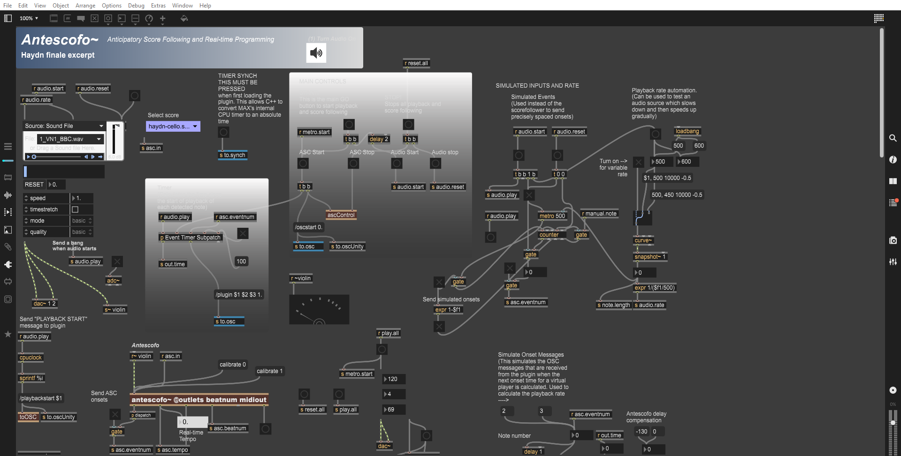
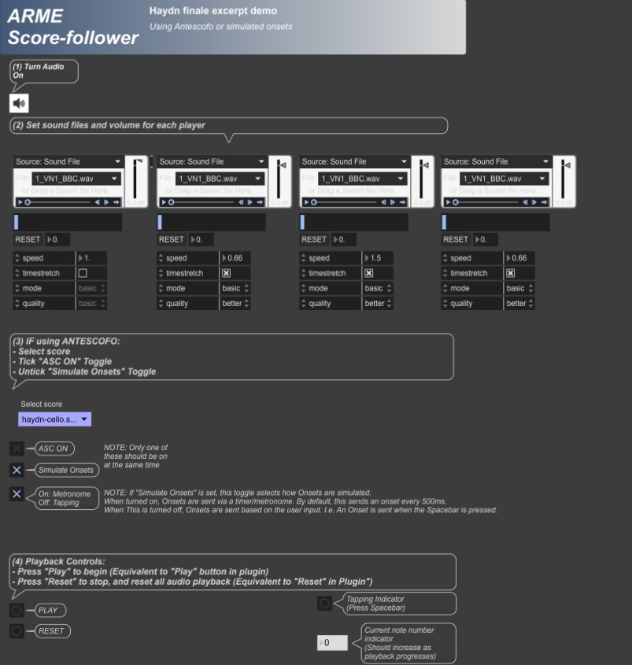

## 1. Clone the repository

Use the following GIT Command if installed:

```
git clone git@github.com:arme-project/score-follower.git
```

If you do not have GIT Install then you can download the repository as a ZIP file:


- This is used for the Metronome but the same idea works the same with the score-follower

## 2. Extracting Antescofo

Before you can start anything, you will need **Antescofo** plugin to be able to run correctly. Inside the folder, under `Packages` you can find a packaged `Antescofo` which you will need to extract and move the folder to where Max 9 can find for External Packages. In this case, you will need to find the `Packages` directory that Max 9 look in.

You can find this in Max 9 under `Options > File Preferences...`, where it says `User Library` you can find the `Package` in the parent directory of `Library` where you can put the extracted Antescofo in:


You can then open the `score-follower` inside the directory which opens the project in Max 9 (indicate if needed):



## 4. Opening Presentation Mode

In Max 9, you will find an option at the bottom of the window which look this:


This should open a new view that is simplified and much easier to use to run the Score-Follower:


From here, the aim for this is to simplify the demonstration without the worry of pressing the wrong thing. As seen, the following steps are:
1. Turning the Audio
2. Setting the sound files and volume for each Player
3. Choosing between Onsets to AdaptiveMetronome (Simulated Onset or ANTESCOFO)
4. Playback Options