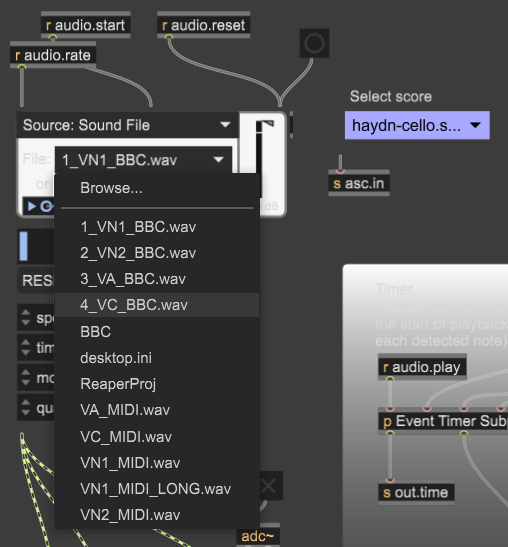
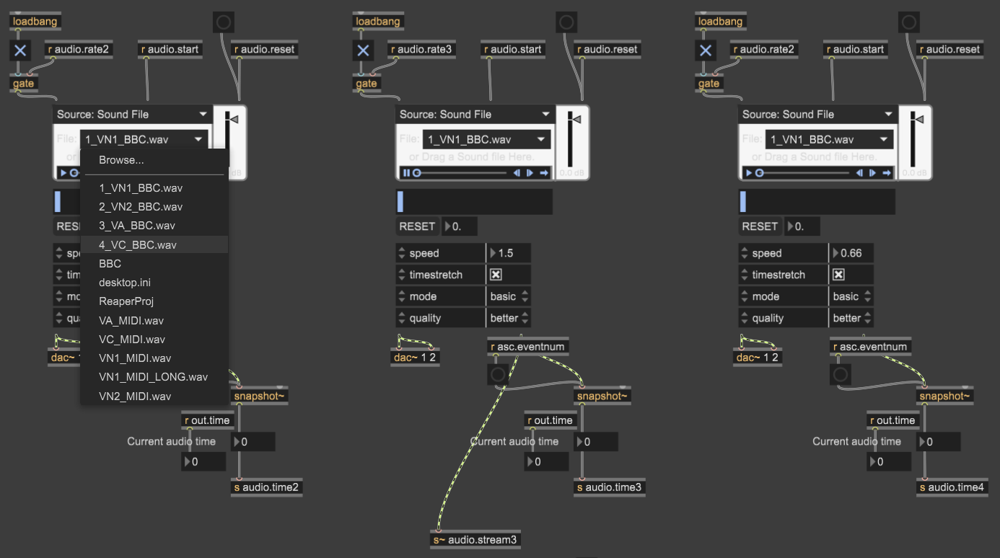
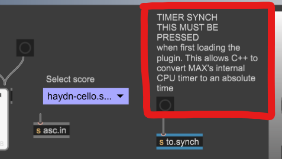

## 1. Clone the repository

Use the following GIT Command if installed:

```
git clone git@github.com:arme-project/score-follower.git
```

If you do not have GIT Install then you can download the repository as a ZIP file:


- This is used for the Metronome but the same idea works the same with the score-follower

## 2. Extracting Antescofo

Before you can start anything, you will need **Antescofo** plugin to be able to run correctly. Inside the folder, under `Packages` you can find a packaged `Antescofo` which you will need to extract and move the folder to where Max 9 can find for External Packages. In this case, you will need to find the `Packages` directory that Max 9 look in.

You can find this in Max 9 under `Options > File Preferences...`, where it says `User Library` you can find the `Package` in the parent directory of `Library` where you can put the extracted Antescofo in:


You can then open the `score-follower` inside the directory which opens the project in Max 9 (indicate if needed):


## 3. Set Audio Files for each Player

You can set the audio file used for each player that should be played for each player.

The top four selections are pre-recorded audio we can use to play the notes.

For the user player (very top left of the project):



You can also set the audio files for the rest of the players on the Ensemble (near the bottom of the project):



## 4. Methods of Onsets

There are currently three different ways to send Onsets to the Adaptive Metronome (running in the background) which you can select from:

1. Simulated Onsets - Based on a metronome an Onset is generated automatically periodically (defaulted to 0.5 seconds).
2. Manual Tapping - Generate enerate onsets when the user taps the Spacebar or through a MIDI device
3. Antescofo - Score loaded into Antescofo, and pre-recorded audio file or audio from microphone plays into Antescofo

## 5. Playing the Model

Before you press `Play`, you will want to synchronise the Adaptive Metronome and Max 9 by pressing the Timer Synchronise button found at the top middle of the project:



Make sure that the `hadyn2.mid` file is loaded into the Adaptive Metronome and that you turn audio on Max (top volume symbol in the project or bottom right of the program (off/on symbol)).

Once you have done all of this, you can press `Play` in the Metronome or the checkbox under `START` in Max 9 (middle white box) to start the Ensemble. To stop the playback, press `Reset` in the Metronome or checkbox under `STOP` in Max 9.
