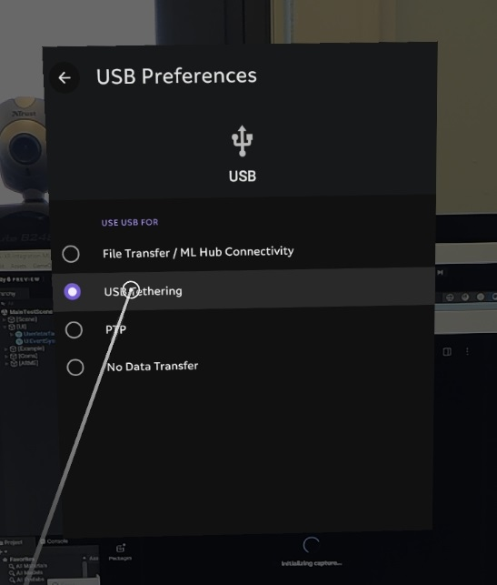
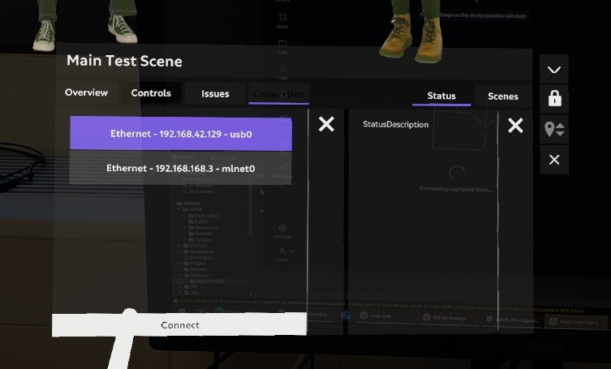

1. The **MAX/MSP** Score follower must be running for the headset to connect to. 

1. Install Magic Leap Hub 3 (download from [Magic Leap Hub 3](https://ml2-developer.magicleap.com/downloads)).

1. Connect **Magic Leap 2** to **PC** via a **USB** cable and select **USB Tethering** as connection style when prompted inside the headset. Or this can be changed afterwards in `Settings -> Connected Devices -> USB`.

1. Load the **ARME** app on the headset, and click on the **Connections** tab.

1. Identify and select the connection that corresponds to the **USB** link between **PC** and headset. This should be called, e.g. `Ethernet - 192.168.42.129 - usb0`. The exact IP address can vary. 

1. Clicking **Connect** should start the automatic connection process with the **MAX/MSP** score follower. If this works the menu should change to **Connected**. If this does not work, it will be stuck on **... Connecting** indefinitely.

1. Once connected, the headset will respond to reset and play commands automatically. 
